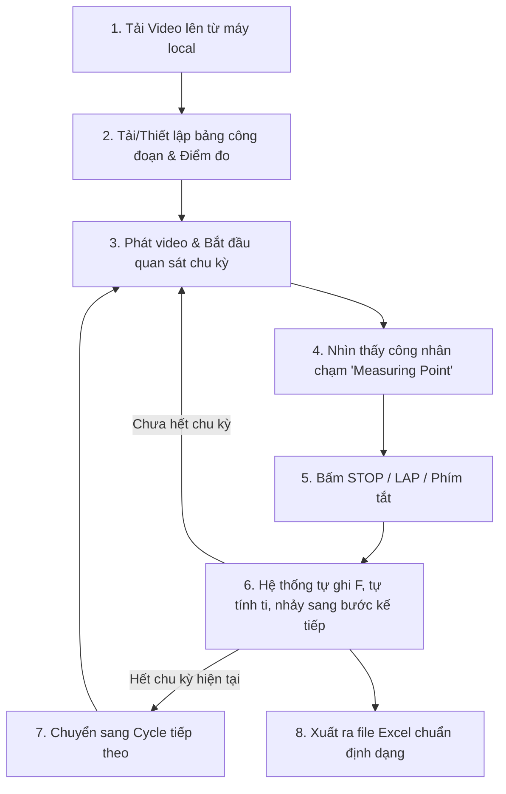

# TÀI LIỆU KHÁI QUÁT DỰ ÁN (PROJECT SPECIFICATION)
## CÔNG CỤ PHÂN TÍCH THỜI GIAN THAO TÁC QUA VIDEO (VIDEO TIME STUDY TOOL)

---

## 1. TỔNG QUAN DỰ ÁN (PROJECT OVERVIEW)

### 1.1. Bối cảnh & Mục tiêu
Trong môi trường sản xuất công nghiệp, việc nghiên cứu thời gian và động tác (**Time & Motion Study** / **Cycle Time Analysis**) của công nhân trên dây chuyền là nhiệm vụ cốt lõi của bộ phận Kỹ thuật Công nghiệp (Industrial Engineering - IE / Lean). 

Hiện tại, kỹ sư thường phải:
1. Xem video quay lại thao tác của công nhân.
2. Dùng đồng hồ bấm giờ hoặc nhìn mốc thời gian trên video thủ công.
3. Ghi chép ra giấy hoặc gõ từng giây vào file Excel.
4. Tự trừ thời gian giữa các lần bấm để ra thời gian từng bước ($t_i$).

**Mục tiêu dự án:** Xây dựng một công cụ nội bộ nhẹ, trực quan, hỗ trợ xem video trực tiếp trên trình duyệt, cho phép bấm dừng/ghi mốc tại từng điểm kết thúc thao tác (**Measuring point**), tự động tính toán thời gian chu kỳ và tự động điền vào mẫu bảng tính Excel chuẩn của công ty.

### 1.2. Ràng buộc Kỹ thuật & Tuân thủ IT (IT Compliance)
- **Tuyệt đối không dùng file `.exe` / phần mềm cài đặt:** Bộ phận IT công ty kiểm soát chặt chẽ quyền Admin và chặn cài file `.exe`.
- **Giải pháp:** Xây dựng ứng dụng dạng **Web Client-Side (HTML5 + CSS + JavaScript)**:
  - Chạy trực tiếp trên trình duyệt nội bộ (Google Chrome, Microsoft Edge).
  - Không cần cài đặt bất kỳ phần mềm nào vào hệ điều hành.
- **Bảo mật dữ liệu tuyệt đối (Zero Data Leak):** 
  - Video quay dây chuyền công nghiệp chứa bí mật quy trình sản xuất.
  - Ứng dụng xử lý video hoàn toàn trên RAM máy tính cục bộ thông qua **HTML5 File API** (`URL.createObjectURL`), không tải video lên bất kỳ máy chủ bên ngoài nào.
  - Video dung lượng lớn (1GB - 5GB) mở tức thì không giật lag, không tốn băng thông mạng.

---

## 2. PHÂN TÍCH FORM MẪU EXCEL (TIME STUDY SHEET ANALYSIS)

Dựa trên biểu mẫu chuẩn được cung cấp:

```
+-----+----------------------------------+---------------+-----------------+--------+---+---+---+---+---+---+
| No. | Process sequence & measuring pt  | Ref. Quantity | Measured values | Cy / mt| 1 | 2 | 3 | 4 | 5 |...|
+-----+----------------------------------+---------------+-----------------+--------+---+---+---+---+---+---+
|  1  | Pick up the harness from grey box|       1       |                 | L      |100| 98|100|   |   |   |
|     | Harness on the board             |               |                 | ti     | 5 | 8 | 6 |   |   |   |
|     |                                  |               |                 | F      |   |   |   |   |   |   |
+-----+----------------------------------+---------------+-----------------+--------+---+---+---+---+---+---+
```

### 2.1. Cấu trúc các cột chính:
1. **`No.`**: Thứ tự bước công việc (1, 2, 3, 4, 5, 6, 7, ...).
2. **`Process sequence and measuring point`**:
   - **Tên thao tác (Process sequence):** Ví dụ: *Pick up the harness from grey box*, *Plug-in the connector on PA*, *Testing*, *Take out the harness*...
   - **Điểm kết thúc đo (Measuring point):** Điểm mốc trực quan để người bấm giờ nhận biết khi nào bước kết thúc. Ví dụ: *Harness on the board*, *Press 1st enter*, *Press 2nd enter*, *Operator hold the harness and turn-around*...
3. **`Ref. Quantity`**: Số lượng linh kiện/sản phẩm thao tác trong bước (VD: 1, 20...).
4. **`Measured values`**: Giá trị đo đạc tổng hợp / trung bình.
5. **`Cy / mt` (Các chỉ số trong một chu kỳ đo):**
   - **`L` (Rating Factor / Đánh giá hiệu suất):** Hệ số tốc độ làm việc của công nhân (VD: 100%, 98%, 105%...).
   - **`ti(hm)` (Element Time in HM):** Thời gian thực hiện bước hiện tại quy đổi sang đơn vị chuẩn IE: Hundredths of a Minute (HM), làm tròn số nguyên.
   - **`F (thời gian của video)` (Cumulative Video Time):** Mốc thời gian tích lũy trên video khi người dùng bấm dừng/ghi mốc tại điểm Measuring point (tính theo giây).
6. **Các cột chu kỳ `1, 2, 3, 4, ... 15` (Cycles):** 
   - Đo lặp lại nhiều chu kỳ liên tiếp để tính toán phương sai, độ ổn định và thời gian chuẩn (Standard Time).

### 2.2. Công thức tính toán cốt lõi:
- **Phương pháp đo liên tục (Continuous Timing Method):**
  - Mốc thời gian video ghi nhận tại bước thứ $i$: $F_i$
  - Mốc thời gian video ghi nhận tại bước trước đó: $F_{i-1}$
  - Thời gian thực tế của bước $i$ (theo giây): 
    $$t_i = F_i - F_{i-1}$$
  - Quy đổi sang đơn vị chuẩn HM:
    $$ti(hm) = \text{round}\left(\frac{t_i}{60} \times 100\right)$$
  *(Đối với bước đầu tiên của chu kỳ: $t_1 = F_1 - F_{\text{bắt đầu chu kỳ}}$)*.

---

## 3. QUY TRÌNH HOẠT ĐỘNG CỦA HỆ THỐNG (USER WORKFLOW)



1. **Bước 1: Nạp dữ liệu đầu vào**
   - Chọn file video từ máy tính (hỗ trợ định dạng phổ biến: `.mp4`, `.webm`, `.mov`).
   - Nạp file Excel mẫu (hoặc cấu hình sẵn danh sách các bước thao tác trên giao diện).
2. **Bước 2: Quá trình bấm giờ (Active Time Study)**
   - Người dùng xem video ở tốc độ bình thường hoặc chậm (1x, 0.75x, 0.5x, 0.25x) để bắt chính xác từng khung hình.
   - Khi phát hiện thao tác hoàn thành đúng điểm `Measuring point` -> Bấm phím tắt (VD: `Space` hoặc `Enter`):
     - Ghi nhận $F$ = `video.currentTime`.
     - Tự động tính $t_i = F_i - F_{i-1}$.
     - Điền tự động vào bảng hiển thị trên web.
     - Tự động nhảy highlight sang bước tiếp theo để người đo sẵn sàng cho bước kế tiếp.
3. **Bước 3: Hiệu chỉnh & Chấm điểm (Rating)**
   - Cho phép người đo tua lại mốc vừa bấm nếu bấm hụt hoặc bấm sai.
   - Nhập hệ số đánh giá $L$ (mặc định là 100).
4. **Bước 4: Xuất báo cáo (Export Excel)**
   - Nhấn "Xuất Excel" -> Hệ thống tự động ghi toàn bộ giá trị $F, t_i, L$ vào đúng các ô trong template Excel ban đầu, giữ nguyên 100% định dạng, kẻ bảng và công thức của file mẫu.

---

## 4. CÁC TÍNH NĂNG DỰ KIẾN (PLANNED FEATURES)

### 4.1. Trình phát Video chuyên dụng cho IE (Industrial Video Player)
- Hỗ trợ đầy đủ điều khiển: Play, Pause, Tua nhanh / Tua chậm (0.1x, 0.25x, 0.5x, 1x, 1.5x, 2x).
- **Frame-by-frame Step:** Tua tới / lùi từng khung hình (khoảng 0.03 - 0.04 giây mỗi frame) để xác định mốc cực kỳ chính xác.
- **Hệ thống phím tắt (Keyboard Shortcuts):**
  - `Space`: Tạm dừng / Tiếp tục phát.
  - `Enter` hoặc `F`: Ghi nhận mốc thời gian (Stop & Record Stamp).
  - `←` / `→`: Tua lùi / tiến 1 giây.
  - `Shift + ←` / `Shift + →`: Lùi / tiến 1 frame.
  - `↑` / `↓`: Tăng / giảm tốc độ video.

### 4.2. Bảng theo dõi tương tác (Interactive Time Study Grid)
- Hiển thị song song với video: Cột công đoạn, điểm đo, trạng thái hiện tại.
- Tự động highlight hàng đang thực hiện.
- Cho phép chỉnh sửa trực tiếp nếu bấm nhầm thời gian mà không cần đo lại từ đầu.
- Hỗ trợ nhiều chu kỳ đo (Cycle 1 đến Cycle 15+).

### 4.3. Xử lý Excel Client-side (In-browser Excel Engine)
- Sử dụng thư viện JavaScript chuyên xử lý file bảng tính (`ExcelJS` / `SheetJS`).
- Đọc template `.xlsx` có sẵn, bảo toàn nguyên vẹn format, màu sắc, font chữ và các ô gộp (merge cells).
- Đổ dữ liệu tự động vào đúng tọa độ ô (cell coordinates).
- Tải trực tiếp file kết quả về máy người dùng.

---

## 5. CÔNG NGHỆ ĐỀ XUẤT (TECH STACK)

| Thành phần | Công nghệ đề xuất | Lý do lựa chọn |
| :--- | :--- | :--- |
| **Kiến trúc** | Client-side Single Page App (SPA) | Không cần cài đặt, không cần server backend, IT không chặn |
| **Giao diện & Logic** | HTML5 + CSS3 + Modern JavaScript (hoặc React/Vite) | Nhẹ, chạy mượt trên mọi trình duyệt hiện đại |
| **Xử lý Video** | HTML5 Video API | Điều khiển mốc thời gian chính xác tới millisecond |
| **Xử lý Excel** | ExcelJS / SheetJS (xlsx) | Thư viện mạnh mẽ nhất để đọc/ghi file `.xlsx` trên trình duyệt |
| **Lưu trữ tạm** | LocalStorage / IndexedDB | Tự động lưu tiến độ đo, tắt trình duyệt mở lại không mất dữ liệu |

---

## 6. BƯỚC TIẾP THEO (NEXT STEPS)

1. Thống nhất cấu trúc và luồng xử lý trong tài liệu này.
2. Tiếp nhận các yêu cầu chi tiết tiếp theo từ bạn:
   - File Excel mẫu thực tế (tọa độ các ô cần điền cụ thể).
   - Cách tổ chức các chu kỳ đo (chuyển chu kỳ thủ công hay tự động khi hết bước cuối).
   - Các công thức tính bổ sung (ví dụ: trung bình cộng, loại trừ giá trị bất thường...).
3. Xây dựng bộ khung giao diện mẫu (UI Prototype) gồm: Khung phát Video bên trái + Bảng danh sách công đoạn & mốc thời gian bên phải.
